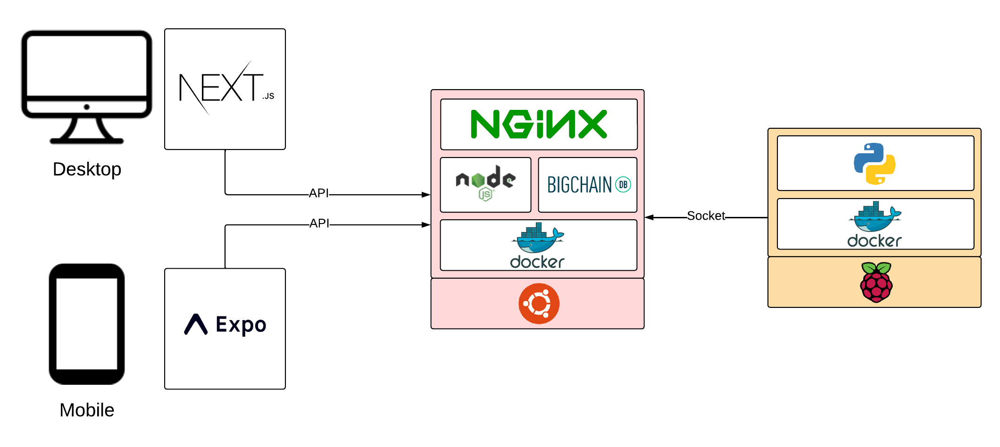
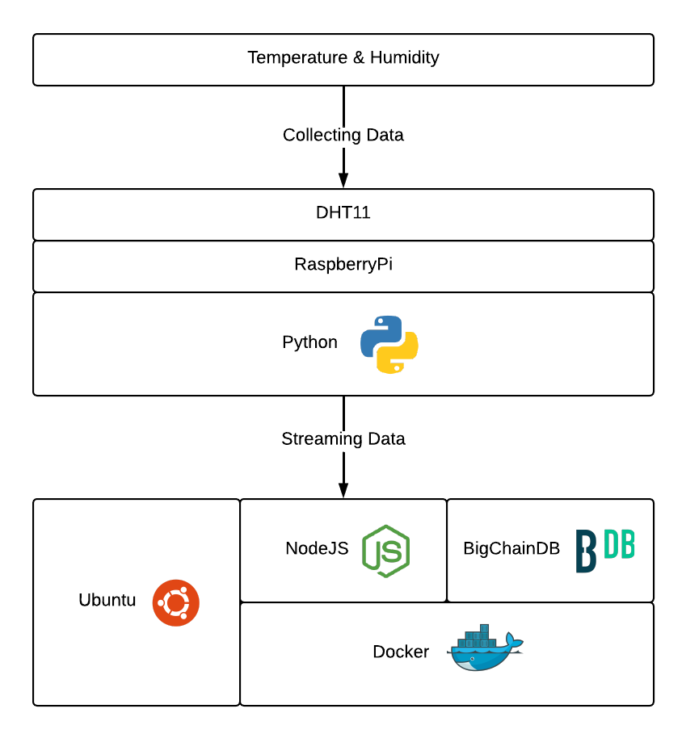

# ThinkBig: IoT Blockchain System

## Overview

ThinkBig is an IoT Blockchain System designed to capture and process temperature and humidity data on the blockchain. This repository contains both the server-side and Raspberry Pi streaming components.

## Table of Contents

1. [Architecture](#architecture)
2. [Technologies Used](#technologies-used)
3. [Getting Started](#getting-started)
   - [Server Setup](#server-setup)
   - [Raspberry Pi Setup](#raspberry-pi-setup)
4. [Project Structure](#project-structure)
   - [Server](#server)
   - [Raspberry Pi Stream](#raspberry-pi-stream)
5. [Contributing](#contributing)
6. [License](#license)

## Architecture

## Getting Started
