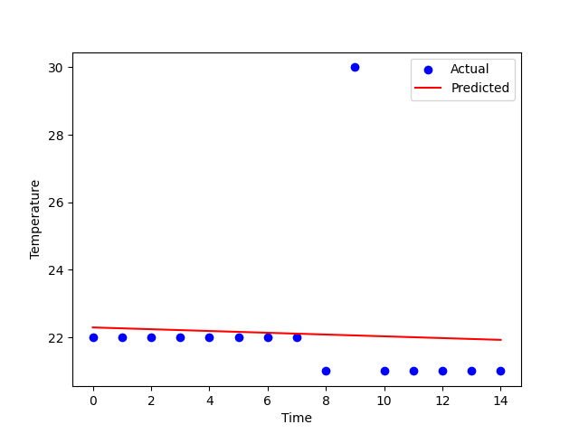

# Regression for Fraud Detection in ThinkBig

## Introduction

ThinkBig is a decentralized weather monitoring system where anyone can contribute data. However, with open data contributions, there's a risk of receiving fake or erroneous data. In this notebook, we'll explore how to utilize linear regression to detect and potentially remove fraudulent or anomalous data points from the ThinkBig dataset.

Our goal is to build a simple linear regression model that can learn from the data contributed to the ThinkBig and identify anomalies, helping to maintain the integrity of the dataset.

Let's proceed with the implementation.

## Importing Libraries

First, let's import the necessary libraries: PyTorch for creating and training the linear regression model, NumPy for handling numerical data, and Matplotlib for visualization.

```python
import torch
import torch.nn as nn
import numpy as np
import matplotlib.pyplot as plt
```

## Data Generation

We'll generate synthetic data representing temperature readings over time. The data will include a fraudulent value (anomaly) to demonstrate how our model detects anomalies.

```python
# Data
timestamps = np.arange(0, 15).reshape(-1, 1)
temperature = np.array([22.0, 22.0, 22.0, 22.0, 22.0, 22.0, 22.0, 22.0, 21.0, 30.0, 21.0, 21.0, 21.0, 21.0, 21.0]).reshape(-1, 1)
```

## Model Definition

Next, we define our linear regression model using PyTorch.

```python
# Model
model = nn.Linear(1, 1)
```

## Training the Model

We train our linear regression model using gradient descent to minimize the mean squared error loss.

```python
# Loss function and optimizer
criterion = nn.MSELoss()
optimizer = torch.optim.SGD(model.parameters(), lr=0.01)

# Training
for epoch in range(1000):
    optimizer.zero_grad()
    outputs = model(torch.tensor(timestamps, dtype=torch.float32))
    loss = criterion(outputs, torch.tensor(temperature, dtype=torch.float32))
    loss.backward()
    optimizer.step()
```

## Visualization

Finally, we visualize the actual temperature readings along with the predicted values from our regression model.

```python
# Plotting
plt.scatter(timestamps, temperature, color='blue', label='Actual')
plt.plot(timestamps, model(torch.tensor(timestamps, dtype=torch.float32)).detach().numpy(), color='red', label='Predicted')
plt.xlabel('Time')
plt.ylabel('Temperature')
plt.legend()
plt.show()
```

The red line represents the regression line predicted by our model. Anomalies, such as the imposter temperature value at timestamp 10, can be detected by observing deviations from this line.

